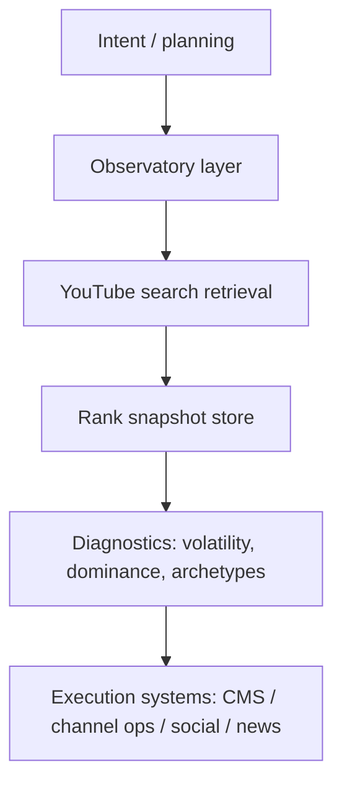
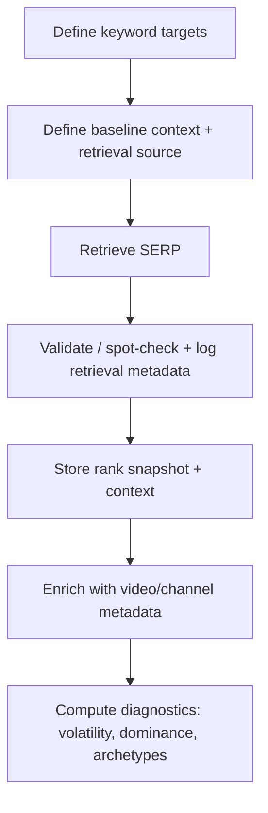

# Deep Research Audit of the VEDA YouTube Observatory Research Plan

## Executive summary

The document is a solid high-level blueprint for adding a YouTube “ranking observatory” alongside an existing SERP observatory in entity["organization","VEDA","search observatory product"]. Its strongest parts are the crisp product identity (“discovery ecosystems, not social chatter”), the clear separation between observability and execution, and the intent to treat rankings as time-series diagnostics rather than vanity metrics.

The biggest problem is that the plan quietly assumes YouTube search rankings can behave like a deterministic SERP. They can’t. YouTube explicitly says it “strive[s] to deliver personally relevant search results” and may use a viewer’s search/watch history; meaning two users can see different results for the same query. citeturn9view0 If the observatory doesn’t define a **standardized baseline context** (region/language/history/safety mode, logged-in vs logged-out, etc.), you won’t be tracking “ranking movement”—you’ll be tracking “ranking movement plus personalization noise plus platform experiments,” which is… vibes-based observability.

Second, the plan’s implicit data-source assumption (“YouTube Data API search ≈ YouTube website search”) is risky. A major 2025 audit of the YouTube Data API search endpoint finds serious limitations in completeness, consistency, and temporal “forgetting” (discoverability dropping sharply 20–60 days after publication) and warns about replicability problems even with identical queries. citeturn14view0turn2search7 If you build a ranking observatory on top of unstable retrieval, your “volatility” metric may mostly measure the API’s quirks.

Third, the plan doesn’t yet treat compliance as a first-class constraint. YouTube’s Terms prohibit accessing the service via automated means (including scrapers) except for public search engines per robots.txt or with prior written permission. citeturn12view0 That doesn’t kill the project, but it forces an explicit decision: **official API-first**, or **third-party SERP providers** (who may be handling browser-like retrieval for you) with clear risk management.

Bottom line: the plan is directionally good, but it needs (1) a formal definition of “observatory-grade ranking,” (2) an evidence-backed decision on retrieval method(s), and (3) a tightened methodology section so the eventual system measures what you think it measures.

## What the document proposes for entity["company","YouTube","video platform"] observability

The document is a research plan (not an implementation spec) aimed at designing a “YouTube Observatory Layer” that mirrors a SERP observatory: define keyword targets, query YouTube search, capture ranked results, store snapshots, and measure rank shifts over time.

It separates “observing discovery ecosystems” from “execution systems” (CMS publishing, social posting, etc.), which is conceptually aligned with measurement integrity: diagnostics should not be polluted by operational actions.

One constraint note: only this single markdown document was available for review. If you intended additional docs (architecture diagrams, existing schema, VEDA “SERP Observatory model” notes, etc.), they weren’t available in the current workspace—re-upload them if you want this audit to reconcile against the real implementation.

Here is the document’s implied system boundary, rewritten as an explicit data-flow:

## Detailed annotated findings with citations and reliability ratings

### Reliability scale used
A = primary/official or peer-reviewed with clear methods; B = credible but self-interested or less independently verified; C = weak (marketing/blog/community anecdote).

### Annotated findings table

| Finding area | What the plan needs / implies | What high-quality sources actually say | Design implication | Reliability |
|---|---|---|---|---|
| “YouTube search ranking works like a SERP” | Rankings are measurable positions that can be tracked over time | YouTube identifies three key elements used in search ranking: relevance, engagement, and quality, and says weighting varies by search type. citeturn9view0turn9view2 | Model rankings as *contextual outputs* (query + locale + safety + time + user-state), not as a single objective ordering | A |
| Determinism assumption | A “clean lens” implies avoiding “social noise” and focusing on deterministic ranking | YouTube says it may also consider a user’s search/watch history, so results “might differ from another user’s search results for the same query.” citeturn9view0 | Define a baseline context (logged-out, no-history) and treat personalization as a separate lens, not an ignored nuisance | A |
| Keyword metadata importance | Research includes titles/descriptions/tags and video content match | YouTube explicitly lists title, tags, description, and video content as relevance factors for matching a query. citeturn9view0turn9view1 | Your data model should store what you can actually validate: title/description/tags + transcription proxies where available (but be honest about coverage) | A |
| Engagement vs “noise” | Plan wants to avoid social engagement analytics | YouTube says engagement signals (including watch time for a particular query) are used to determine relevance. citeturn9view0turn9view1 | Engagement isn’t “noise” in search—it’s part of the ranking function. Reframe: avoid *off-platform chatter*, not on-platform engagement signals | A |
| Official retrieval option: Data API search | The plan asks whether the official API supports ranked search retrieval | `search.list` returns search results ordered by an `order` parameter (default “relevance”), supports region/language relevance controls, and costs 100 quota units per call. citeturn3view0turn11view0turn11view3 | Official API can produce an internally consistent “API SERP,” but you must not assume it matches the website SERP | A |
| Official API scaling constraints | Plan wants sustainable solo-dev cost and throughput | Default quota allocation is 10,000 units/day; quota increases require a compliance audit. citeturn12view1turn1search1 With `search.list` at 100 units/call, you get ~100 keyword queries/day at baseline. citeturn3view0turn12view1 | Observatory scope must be sized around expensive search calls; batch everything else (videos/channels) cheaply | A |
| Cheap metadata enrichment | Plan includes video/channel metadata fields | `videos.list` costs 1 unit per call and returns snippet/statistics like tags, categoryId, viewCount, likeCount, etc. citeturn15view1turn6search1 `channels.list` costs 1 unit per call and returns channel metadata including statistics and topicDetails. citeturn8view0turn6search0turn6search6 | Good: split “ranking retrieval” (expensive) from “metadata refresh” (cheap), and refresh metadata on a slower cadence | A |
| Data quality risk: API search behavior | Plan wants “ranking stability” analysis | A 2025 peer-reviewed audit (Information, Communication & Society) reports severe limitations in YouTube API search: temporal decay in discoverability within ~20–60 days, and inconsistent results over time even for identical queries. citeturn14view0turn2search7 | If you use the API as your SERP source, you need a validation layer + disclaimers: some “volatility” will be retrieval instability | A |
| Third-party SERP source: DataForSEO | Plan proposes evaluating entity["company","DataForSEO","seo api vendor"] as a SERP-style alternative | DataForSEO’s YouTube Organic SERP results include absolute rank fields, block names (e.g., “People also watched”), and flags like `is_shorts`, plus a `check_url` for verification. citeturn5view0turn0search14 Pricing is stated per SERP page with different queue modes, and tasks are charged when posted. citeturn0search4turn10search6turn5view0 | This is closer to “what a user sees” (SERP features included). But it’s vendor-reported data: you must spot-check via `check_url` sampling and treat as a measured approximation | B |
| Platform drift / UI changes | Plan assumes stable query mechanics over time | YouTube continues to change search filters and sorting behaviors (e.g., new “Popularity” assessment, filter changes for Shorts vs longform). citeturn0news32 | Version your observatory: store “retrieval method + UI era” so metrics don’t silently mix incomparable regimes | B (news reporting) |
| Compliance constraint on scraping | Plan considers “keyword search scraping capabilities” | YouTube’s Terms prohibit automated access (robots/botnets/scrapers) absent exceptions/permission. citeturn12view0 | Direct scraping of youtube.com is a high-risk foundation. Prefer official APIs or contractually-credible data providers with clear compliance posture | A |
| Regulatory context (optional, but relevant) | If the observatory is ever used for systemic-risk research, access pathways matter | EU Digital Services Act Article 40 creates a framework for data access and scrutiny, including access for vetted researchers and requests for platforms to explain algorithmic systems. citeturn13view1turn2search1turn2search5 The European Commission lists/supervises designated very large online platforms/search engines, and has treated YouTube as such in DSA enforcement communications. citeturn2search2turn2search6 | Not required for a commercial observatory, but it argues for designing clean governance: audit logs, data minimization, reproducibility, and safety controls | A |

## Gaps, contradictions, and unstated assumptions

The document’s “Clean Lens Principle” is good product discipline, but it currently collides with how YouTube search actually works.

**Determinism vs personalization (unstated assumption).** The plan frames “measurable search positions” as if a query yields a single ranking. YouTube explicitly says it may use a viewer’s search/watch history, which makes results user-dependent. citeturn9view0 If you don’t pin down a baseline user-state, your observatory will confuse “ranking movement” with “different user contexts.”

**“Avoid social engagement analytics” vs “YouTube search uses engagement.”** The plan tries to avoid “social engagement analytics,” but YouTube says engagement signals (including query-specific watch time) are used to assess relevance in search. citeturn9view0turn9view1 You can avoid *social listening* (X/Reddit chatter), but you cannot avoid engagement as a ranking factor without misunderstanding the mechanism you’re observing.

**API ≠ website search (critical hidden assumption).** The plan treats “official API” as a candidate for “retrieving ranked search results.” It can return ordered results, yes. citeturn3view0turn11view3 But the best independent evidence says the API search endpoint has major coverage/consistency issues and can “forget” older content quickly, undermining longitudinal research and replicability. citeturn14view0turn2search7 If the observatory’s identity is “telescope for discovery ecosystems,” the telescope lens can’t be fogged up by retrieval artifacts.

**Ranking surface complexity is under-modeled.** Website SERPs can include shelves/blocks (Top News, People also watched, etc.). DataForSEO exposes block metadata; the official API largely returns a flat list of items. citeturn5view0turn3view0 If you want “SERP-style observability,” you must decide whether block structure is part of the observatory object.

**Metric definition drift.** If you store viewCount and compare over time, note that YouTube changed how Shorts views are counted (and how the API reports them). citeturn6search1turn6search11 Without metric versioning, the observatory will eventually “discover” fake growth caused by definition updates.

**Compliance is mentioned but not operationalized.** The plan lists “keyword scraping capabilities” and compares third-party providers, but it doesn’t explicitly constrain choices by YouTube Terms (no automated access) or by API audit/quota obligations. citeturn12view0turn12view1turn1search1 That’s a missing decision gate: “Are we allowed to do the thing we’re proposing?”

## Unsupported or weak claims and how to strengthen them

The plan is mostly aspirational, but several statements are currently “hand-wavy.” That’s normal for a research plan—until it becomes an implementation roadmap and people start treating assumptions as facts.

| Plan claim (paraphrased) | What’s weak about it | Strongest evidence path to fix it | What to store / report |
|---|---|---|---|
| “VEDA should focus on deterministic ranking systems.” | YouTube search is not deterministic due to personalization and varying weight of ranking elements. citeturn9view0turn9view2 | Define “deterministic baseline” as an **operational definition** (e.g., logged-out, no-history, fixed region/language, fixed safeSearch), then test variance across repeated runs | Store context tuple: `{query, timestamp, region, relevanceLanguage, safeSearch, user_state}` and compute variance bands |
| “Official API may support ‘SERP-style’ observability.” | “SERP-style” is undefined: is it top-N videos only, or full SERP with shelves, ads, channels, Shorts filters? Official API returns ordered items, but not SERP blocks. citeturn3view0turn5view0 | Prototype: run matched queries using (a) website SERP (manual, small sample), (b) Data API, (c) SERP vendor. Measure overlap (Jaccard/top-N) and block coverage | Report overlap metrics + qualitative diff examples; decide which surface is your observatory truth |
| “Track ranking movement over time.” | If retrieval is inconsistent, “movement” can be an artifact. Peer-reviewed audit reports inconsistency over time for identical API queries. citeturn14view0turn2search7 | Add a **replicability harness**: same query/context retrieved multiple times per day/week, quantify intra-day and inter-day variance | Store replicate pulls and compute confidence intervals for each rank position |
| “search_volume (if available)” | YouTube Data API does not provide “search volume” for arbitrary keywords; any volume metric is external (Ads/SEO tools) and may measure different populations. (This is a design gap, not a failure.) citeturn3view0turn8view0 | Decide whether volume is in-scope. If yes, specify which provider, what it measures, and how it aligns with YouTube search | Store provenance: `volume_source`, `geo`, `time_window`, `definition` |
| “Keep costs low while preserving observatory value.” | Costs can be low on vendor SERP APIs, but official API quotas throttle keyword breadth unless audited for more. citeturn12view1turn3view0turn0search4 | Build a cost model: keywords × cadence × depth × enrichment calls; run it against default 10k quota, then against vendor pricing | Produce a table: monthly cost vs keyword coverage; pick an MVP scope |

## Recommended edits and rewrites for clarity, accuracy, and structure

These are not “style tweaks.” They’re the surgical edits that keep the plan from becoming an expensive misunderstanding.

### Replace “deterministic ranking” with “standardized baseline ranking”
Current framing will mislead implementers into thinking rank is a single objective value. YouTube says it may personalize results based on history. citeturn9view0

**Rewrite suggestion (drop-in paragraph for Guiding Principles):**  
Define the “observatory SERP” as rankings measured under a standardized, explicitly recorded context (region, language, safety mode, logged-in/out state). Treat personalization as a separate lens to be measured intentionally rather than ignored.

### Add a “Truth surface” decision gate
Right now, “YouTube search” is underspecified: website SERP, official API search endpoint, or vendor SERP approximations.

**Add a short section titled (for example) “Observatory Truth Surface”:**
- If truth surface = **YouTube Data API search**, call it “API SERP” and include limitations (coverage/consistency/temporal decay) with citations. citeturn14view0turn3view0  
- If truth surface = **website SERP**, then you must address Terms restrictions on automated access. citeturn12view0  
- If truth surface = **vendor SERP**, require a validation plan (spot-check via `check_url`, drift monitoring). citeturn5view0  

### Strengthen the methodology from “Investigate…” to “Test…”
The research goals list “investigate” bullets but doesn’t specify methods. Add a minimal but real method section:

- A fixed query set (head + long-tail), repeated pulls, and variance measurement  
- Locale matrix (at least US + one non-US region) using `regionCode` / `relevanceLanguage` where applicable citeturn11view0turn11view3  
- Replicability checks (same query pulled multiple times) to quantify randomness/noise citeturn14view0  

### Upgrade the data model to include context and SERP structure
The current entities (Channel, Video, Keyword Target, Ranking Snapshot) are directionally right. The missing pieces are what make rankings interpretable:

1) **Snapshot context fields** (must-have): `region`, `relevance_language`, `safe_search`, `retrieval_source` (api/vendor), `order`, `device_type` (if relevant), `logged_in_state`. The official API explicitly supports region/language relevance controls and ordering, so capture them. citeturn11view0turn11view3

2) **SERP structure fields** (if using vendor SERP): `block_name`, `result_type`, `rank_absolute`. DataForSEO exposes this explicitly. citeturn5view0

3) **Metric versioning** for anything that can change definition (e.g., Shorts viewCount changes). citeturn6search11turn6search1

### Make compliance explicit instead of implicit
Add a single “Compliance constraints” box:

- No direct scraping of youtube.com as a default approach (Terms restrict automated access). citeturn12view0  
- Quota scale requires compliance audits for expansion (official API). citeturn12view1turn1search1  

This prevents future-you from accidentally building a system that works great right up until it gets shut off.

### Suggested revision of the workflow (conceptual)
Your workflow is currently five steps; keep it, but insert two missing steps: standardize context and validate.

This turns “ranking snapshots” into defensible measurements.

## Prioritized bibliography and primary sources

Priority reflects how “load-bearing” the source is for designing an observatory that won’t lie to you.

### Primary and official sources

- YouTube Help: “How YouTube search works” (ranking elements; personalization caveat; no pay-for-placement claim). citeturn9view0 **Reliability: A**
- YouTube Help: “YouTube performance FAQ” (explicit search ranking factors: match + engagement; not simply most-viewed). citeturn9view1 **Reliability: A**
- YouTube “How YouTube Works” (relevance/engagement/quality framing in search results). citeturn9view2 **Reliability: A**
- YouTube Data API docs: `search.list` (quota cost, parameters like order/maxResults, regionCode, relevanceLanguage). citeturn3view0turn11view0turn11view3 **Reliability: A**
- YouTube Data API docs: quota and compliance audits (default 10,000 units/day; audit required for more). citeturn12view1 **Reliability: A**
- YouTube Data API docs: `videos.list` (quota cost 1; fields included in `snippet`/`statistics`). citeturn15view1turn6search1 **Reliability: A**
- YouTube Data API docs: `channels.list` (quota cost 1; part fields; topicDetails availability). citeturn8view0turn6search6 **Reliability: A**
- YouTube Terms of Service (automated access / scraping restriction). citeturn12view0 **Reliability: A**

### Peer-reviewed and academic work

- entity["people","Bernhard Rieder","media studies researcher"], entity["people","Adrián Padilla","researcher"], entity["people","Òscar Coromina","researcher"] (2025): “Forgetful by design? A critical audit of YouTube’s search API for academic research” (peer-reviewed; documents temporal decay and inconsistency risks). citeturn14view0turn2search7 **Reliability: A**
- entity["organization","arXiv","preprint repository"] version of the same paper (useful for accessible PDF + methods detail). citeturn2search14 **Reliability: A-** (preprint venue, but paper indicates published version of record)

### Vendor documentation and pricing (use with validation)

- DataForSEO YouTube Organic SERP Advanced results schema (rank fields, block names, `check_url`, Shorts flags). citeturn5view0turn0search14 **Reliability: B**
- DataForSEO SERP API pricing overview (per-SERP pricing, modes). citeturn10search6turn0search4 **Reliability: B**
- DataForSEO pricing page noting minimum payment amount. citeturn0search18 **Reliability: B**

### Regulatory and government/official context (optional but relevant for “observatory” governance)

- EU Digital Services Act, Regulation (EU) 2022/2065: Article 40 “Data access and scrutiny” (official text). citeturn13view1turn12view3 **Reliability: A**
- European Commission FAQ on DSA data access for researchers. citeturn2search1 **Reliability: A**
- European Commission announcement on delegated act for DSA data access. citeturn2search5 **Reliability: A**
- European Commission page on designated VLOPs/VLOSEs (updated list and supervision context). citeturn2search6 **Reliability: A**
- European Commission communication referencing YouTube’s DSA obligations after designation. citeturn2search2 **Reliability: A**

### Platform-change indicators (watch these because they break observability assumptions)

- Reporting on YouTube search filter and sorting changes (indicator of SERP regime drift). citeturn0news32 **Reliability: B**